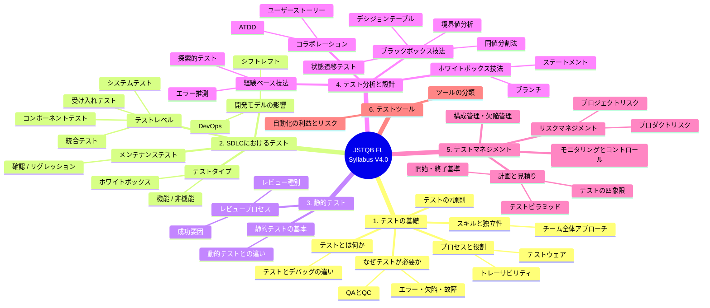

最近、初心に帰って、**JSTQB Foundation Level** の資格を取得しようと思っています。

とりあえず、 シラバス（V4.0）を読み込んで、マインドマップ化しました。

JSTQB Foundation Level (Syllabus V4.0)：
https://jstqb.jp/syllabus.html#syllabus_corefoundation

{/* excerpt */}

## JSTQB Foundation Level (Syllabus V4.0) 概要

### 1. テストの基礎
- **テストとは何か？**
  - 典型的なテスト目的
  - テストとデバッグの違い
- **なぜテストが必要か？**
  - 品質保証 (QA) と品質管理 (QC)
  - エラー・欠陥・故障・根本原因
- **テストの7原則**
- **テストプロセスと役割**
  - テスト活動とタスク
  - テストウェア
  - トレーサビリティ
- **必要不可欠なスキルとよい実践例**
  - チーム全体アプローチ
  - テストの独立性

### 2. SDLC全体を通してのテスト
- **開発モデルの影響**
  - DevOpsとテスト
  - シフトレフトアプローチ
- **テストレベル**
  - コンポーネントテスト
  - 統合テスト (コンポーネント統合 / システム統合)
  - システムテスト
  - 受け入れテスト
- **テストタイプ**
  - 機能テスト
  - 非機能テスト
  - ホワイトボックステスト
- **メンテナンステスト**
  - 確認テストとリグレッションテスト

### 3. 静的テスト
- **静的テストの基本**
  - 静的テストと動的テストの違い
- **レビュープロセス**
  - レビュー種別 (非形式的 / ウォークスルー / テクニカルレビュー / インスペクション)
  - レビューの成功要因

### 4. テスト分析と設計
- **ブラックボックステスト技法**
  - 同値分割法
  - 境界値分析 (2値 / 3値)
  - デシジョンテーブルテスト
  - 状態遷移テスト
- **ホワイトボックステスト技法**
  - ステートメントテスト
  - ブランチテスト
- **経験ベースのテスト技法**
  - エラー推測
  - 探索的テスト
  - チェックリストベースドテスト
- **コラボレーションベースのアプローチ**
  - ATDD (受け入れテスト駆動開発)
  - ユーザーストーリーと受け入れ基準

### 5. テストマネジメント
- **計画と見積り**
  - 開始基準と終了基準
  - 見積り技法 (3点見積り / プランニングポーカー等)
  - テストピラミッド
  - テストの四象限
- **リスクマネジメント**
  - プロジェクトリスクとプロダクトリスク
  - リスク分析とコントロール
- **モニタリングとコントロール**
- **構成管理と欠陥マネジメント**

### 6. テストツール
- **ツールの分類と支援**
- **テスト自動化の利点とリスク**

## マインドマップ

