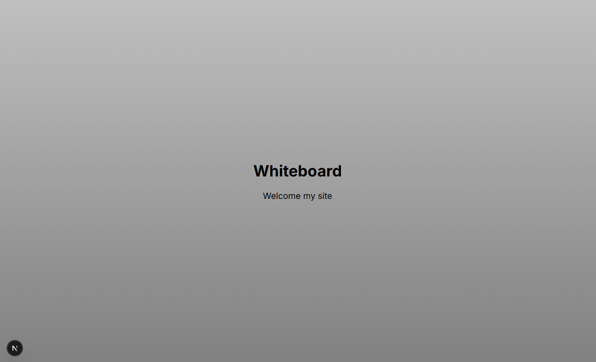
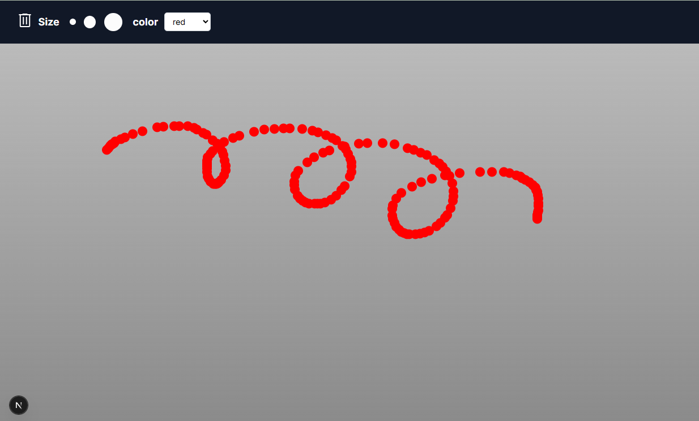
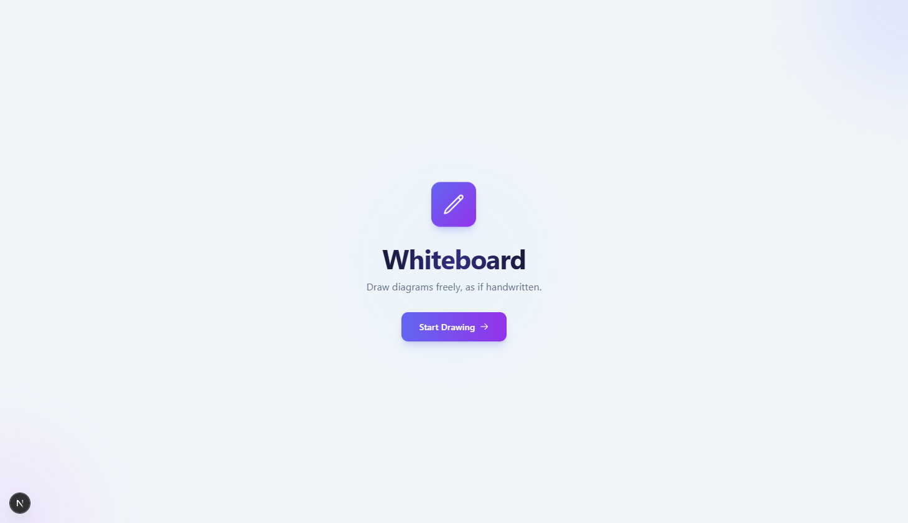
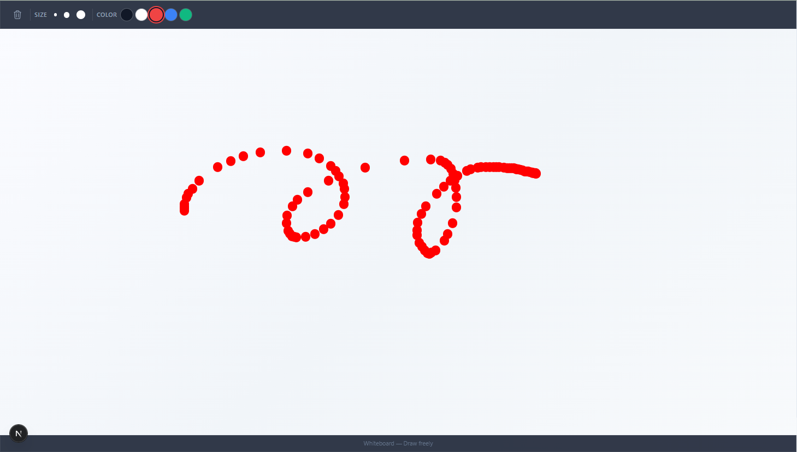

## はじめに

**バイブコーディング（Vibe Coding）** という言葉をご存知でしょうか。これは、具体的な技術仕様ではなく「雰囲気」や「感覚」といった抽象的な指示でコードを生成・修正するAI開発の新しいスタイルです。

「AIに開発を任せる」ってどんな感じなのか興味があったのですが、Claude Codeを使って実際に体験したことは、想像を遥かに超えるものでした。

今回は、簡単なホワイトボードアプリのUIを改善してもらった体験を通じて、**たった一言の「バイブ」でどこまでできるのか**を検証してみました。

{/* excerpt */}

## 試したこと：バイブコーディングの実践

私がClaude Codeに伝えたのは、たったこれだけです。

> 「UIがダサいので、かっこよくしてください」

具体的なデザイン指示も、色の指定も、レイアウトの要望も何もありません。**ただ「ダサい」から「かっこよく」してほしい、** それだけです。

これこそが、まさに**バイブコーディング**です。技術的な詳細ではなく、「こんな雰囲気にしたい」という感覚的な要求だけを伝える。従来の開発では考えられなかったアプローチです。

正直、こんな曖昧な指示で何かが変わるとは思っていませんでした。せいぜい色が少し変わる程度だろう、と。

## Before：機能はあるけど...

修正前のホワイトボードアプリは、こんな感じでした。

*修正前：シンプルだけど... あまりにもシンプルすぎる起動画面*

*修正前：グレー背景に黒ボタン。機能的だけど、確かに「ダサい」かも*

機能としては問題ありません。描画もできるし、色も選べます。でも、デザインという観点では...確かに「ダサい」と言わざるを得ません。

- 背景はただのグレー
- UIパーツは最小限
- 「Welcome my site」というテキストが寂しげ
- 全体的に無機質で冷たい印象

## After：驚きの変貌

そして、Claude Codeが修正した結果がこちらです。

*修正後：グラデーション背景にパープルのアクセントカラーが映える*

*修正後：ツールバーが洗練され、全体的にモダンな印象に*

**正直、驚きました。**

- 背景が美しいグラデーションに
- アイコンがモダンなデザインに刷新
- パープル系の統一されたカラースキーム
- 適切な余白とバランス
- 「Draw freely」という洗練されたコピー
- ボタンに矢印アイコンが追加され、UIとしての誘導性が向上

## 何が起きたのか：Claude Codeの思考プロセス

たった一言「かっこよくして」という指示から、Claude Codeは以下のような判断をしたと考えられます。

1. **現状分析**：既存のUIを解析し、改善点を特定
2. **デザイントレンド理解**：モダンなUIデザインの原則を適用
3. **配色の選択**：パープル系という現代的で親しみやすい色を選定
4. **視覚的階層の構築**：グラデーション、シャドウ、適切なコントラストで視認性向上
5. **ユーザー体験の最適化**：コピーの改善、アイコンの追加など細部にも配慮

これらすべてを、**具体的な指示なしに**自律的に実行したのです。

## なぜこれが凄いのか

### 1. 抽象的な要求の理解

「ダサい」「かっこいい」という極めて主観的で曖昧な表現を、Claude Codeは適切に解釈しました。これは単なるキーワードマッチングではなく、**デザインの良し悪しを理解している**証拠です。

### 2. 総合的なUIセンス

色を変えるだけではなく、以下の要素を総合的に改善しています。

- タイポグラフィ
- レイアウト
- 配色
- アイコンデザイン
- ユーザーガイダンス（コピーライティング）

これは、**デザインシステム全体**を理解していないとできません。

### 3. コンテキストの把握

「ホワイトボードアプリ」というコンテキストを理解し、そのツールに適したデザインを提案しています。例えば、クリエイティブなツールにふさわしい柔らかさと親しみやすさを表現しています。

## バイブコーディングが開く新しい開発体験

この体験を通じて感じたのは、**AI開発ツールが「指示の実行者」から「デザインパートナー」へと進化している**ということです。

### バイブコーディングの革新性

従来の開発では、デザイナーが詳細なモックアップを作り、それを開発者が実装するという分業が一般的でした。しかしバイブコーディングでは、以下のような新しいワークフローが可能になります。

1. **感覚的な要望を伝える**：「ダサい」「かっこいい」「モダンに」など
2. **AIが解釈・提案する**：デザインの方向性を自律的に決定
3. **即座に実装される**：コードレベルでの実現まで一気通貫

この「曖昧さを許容する開発」は、特に以下のような場面で威力を発揮するでしょう。

- **プロトタイピング段階**：アイデアを素早く形にしたい時
- **個人開発**：デザインリソースが限られている時
- **UI改善の試行錯誤**：複数のデザイン案を短時間で比較したい時
- **非デザイナーの開発者**：デザインスキルがなくても良質なUIを実現したい時

### 開発の民主化

バイブコーディングは、開発における**「専門知識の壁」を下げる**重要な役割を果たします。CSSの詳細なプロパティを知らなくても、色彩理論を学んでいなくても、「こんな感じにしたい」という思いさえあれば、AIが形にしてくれるのです。

## まとめ：バイブコーディングが示す開発の未来

「UIがダサいので、かっこよくしてください」

このたった一言から、予想を遥かに超える改善が実現しました。

Claude Codeとバイブコーディングは、開発における新しい可能性を示しています。それは単なる「効率化」ではなく、**開発そのものの在り方を変える**イノベーションです。

- 技術仕様書ではなく「雰囲気」で開発できる
- 専門知識がなくても、思い描いたものを形にできる
- AIは手伝うのではなく、**共に創り上げる**パートナーになる

もちろん、すべてのケースでこのように完璧な結果が得られるわけではないでしょう。しかし、少なくとも「AIには創造的な仕事は無理」という思い込みは、もう過去のものになりつつあるのかもしれません。

バイブコーディングは、まだ始まったばかりの新しい開発手法です。あなたも、ぜひ一度試してみてください。きっと、新しい開発体験が待っているはずです。

同時に、エンジニアの役割も変わっていくだろうとなと感じました。AIがコードを書き、デザインを提案する時代において、私たち人間は **「ビジョンを伝える力」** や **「AIと協働するスキル」** が求められるようになるでしょう。

---

**使用したツール**
- [Claude Code](https://docs.anthropic.com/en/docs/build-with-claude/claude-code) by Anthropic

**プロジェクト**
- [ホワイトボードアプリ](https://whiteboard.indigo165e83.com/)（個人開発のシンプルなWebアプリ）

**所要時間**
- 指示から完成まで：数分

