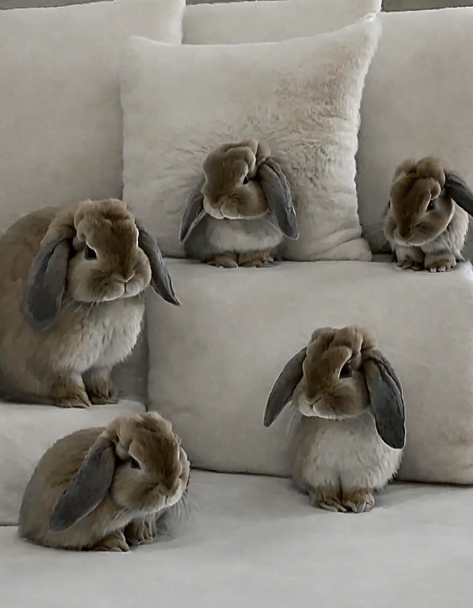
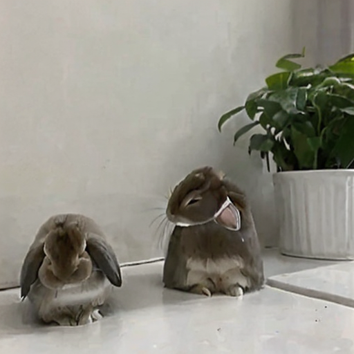
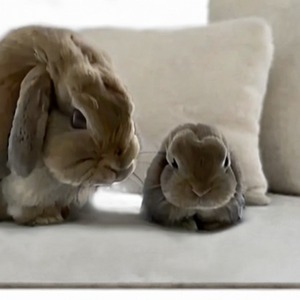

## はじめに

この記事では、ペット（うさぎ）のクッキーの写真から専用のLoRAモデルを訓練し、Stability Matrixで画像生成するまでの全工程を解説します。

WSL2環境でのセットアップから、実際の訓練、そして画像生成まで、実際に遭遇したトラブルシューティングも含めて詳しく記録しています。

### LoRA（ローラ）とは？

AIに追加学習させるための「軽量化技術」のことです。

元の巨大なAIモデル（数GB）をまるごと再学習させるのではなく、覚えさせたい特徴（今回ならペットのクッキー）だけの「差分データ」を作ります。
これにより、短時間（数分）かつ低スペックなPCでも学習が可能になり、出来上がるファイルサイズも非常に小さくなるのが特徴です。

{/* excerpt */}

## 目次

1. 環境構築
2. 訓練データの準備
3. LoRA訓練の実行
4. 画像生成のセットアップ
5. トラブルシューティング

## プロジェクト概要

### 目標
- うさぎ（クッキー）専用のLoRAモデルを作成
- Stable Diffusionでクッキーの画像を生成できるようにする
- 最終的にWebサイトでアニメーション化

### 使用技術スタック
- **OS**: WSL2 (Ubuntu 20.04)
- **Python**: 3.10.13 (pyenv管理)
- **訓練フレームワーク**: Kohya SS GUI
- **ベースモデル**: Realistic Vision V6.0 B1
- **GPU**: NVIDIA GeForce RTX 4060 Ti (8GB VRAM)
- **画像生成**: Stability Matrix + Stable Diffusion WebUI

## 1. 環境構築

### 1.1 Python環境のセットアップ

WSL2環境では、システムのPythonではなくpyenvで管理することを推奨します。

```bash
# pyenvのインストール
curl https://pyenv.run | bash

# .bashrcに設定を追加
echo 'export PYENV_ROOT="$HOME/.pyenv"' >> ~/.bashrc
echo 'export PATH="$PYENV_ROOT/bin:$PATH"' >> ~/.bashrc
echo 'eval "$(pyenv init -)"' >> ~/.bashrc
source ~/.bashrc

# 依存パッケージのインストール
sudo apt update
sudo apt install -y build-essential libssl-dev zlib1g-dev \
libbz2-dev libreadline-dev libsqlite3-dev curl \
libncursesw5-dev xz-utils tk-dev libxml2-dev \
libxmlsec1-dev libffi-dev liblzma-dev

# Python 3.10.13のインストール
pyenv install 3.10.13
```

**重要ポイント**: Python 3.12ではなく3.10系を使用してください。PyTorchや依存パッケージの互換性の問題を避けるためです。

### 1.2 Kohya SS GUIのインストール

```bash
# プロジェクトディレクトリ作成
mkdir -p ~/ml_projects
cd ~/ml_projects

# Kohya SSをクローン
git clone https://github.com/bmaltais/kohya_ss.git
cd kohya_ss

# Python 3.10を使用
pyenv local 3.10.13

# セットアップ実行
./setup.sh

# GUI起動
./gui.sh --headless
```

ブラウザで `http://localhost:7860` にアクセスしてGUIが表示されればOKです。

## 2. 訓練データの準備

### 2.1 写真の収集

**必要な写真枚数**: 15〜30枚（推奨: 20〜25枚）

**撮影のポイント**:
- 様々な角度（正面、側面、後ろ、斜め）
- 様々なポーズ（座る、立つ、食べる、毛づくろい）
- 明るい場所で撮影
- ピントをしっかり合わせる
- 背景はシンプルに

今回はペットカメラの映像から53枚の画像を抽出しました。

### 2.2 画像の前処理

ペットカメラの画像から、背景やうさぎ以外の物体を取り除き、訓練向きの画像にするよう画像を処理します：

```python
#!/usr/bin/env python3
import os
from pathlib import Path
from PIL import Image
from rembg import remove
import numpy as np

# パス設定
input_dir = Path("training_data/cookie/img/20_cookie_rabbit")
output_dir = Path("training_data/cookie/processed")
output_dir.mkdir(parents=True, exist_ok=True)

# 画像ファイルを取得
image_files = sorted(input_dir.glob("*.jpg"))
print(f"Found {len(image_files)} images")

for idx, img_path in enumerate(image_files, 1):
    print(f"Processing {idx}/{len(image_files)}: {img_path.name}")
    
    try:
        # 画像を読み込み
        img = Image.open(img_path)
        
        # 背景除去
        img_no_bg = remove(img)
        
        # クロッピング（被写体を中心に）
        img_array = np.array(img_no_bg)
        alpha = img_array[:, :, 3]
        coords = np.column_stack(np.where(alpha > 0))
        
        if len(coords) == 0:
            continue
            
        y_min, x_min = coords.min(axis=0)
        y_max, x_max = coords.max(axis=0)
        
        # 余白追加
        height = y_max - y_min
        width = x_max - x_min
        margin = int(max(height, width) * 0.1)
        
        y_min = max(0, y_min - margin)
        y_max = min(img_array.shape[0], y_max + margin)
        x_min = max(0, x_min - margin)
        x_max = min(img_array.shape[1], x_max + margin)
        
        cropped = img_no_bg.crop((x_min, y_min, x_max, y_max))
        
        # 512x512にリサイズ
        size = max(cropped.size)
        square_img = Image.new('RGBA', (size, size), (255, 255, 255, 0))
        paste_x = (size - cropped.size[0]) // 2
        paste_y = (size - cropped.size[1]) // 2
        square_img.paste(cropped, (paste_x, paste_y))
        
        final_img = square_img.resize((512, 512), Image.Resampling.LANCZOS)
        
        # 白背景に変換
        white_bg = Image.new('RGB', (512, 512), (255, 255, 255))
        white_bg.paste(final_img, (0, 0), final_img)
        
        # 保存
        output_path = output_dir / f"cookie_{idx:03d}.jpg"
        white_bg.save(output_path, 'JPEG', quality=95)
        
    except Exception as e:
        print(f"Error: {e}")
        continue

print(f"Processing complete!")
```

### 2.3 ディレクトリ構造

訓練用のディレクトリ構造は以下の通り：

```
~/ml_projects/
├── kohya_ss/                    # 訓練ツール
├── models/                      # ベースモデル
│   └── realisticVisionV60B1_v51HyperVAE.safetensors
└── training_data/
    └── cookie_final/
        └── img/
            └── 20_cookie_rabbit/  # 20は繰り返し回数
                ├── cookie_001.jpg
                ├── cookie_002.jpg
                └── ...
```

**重要**: フォルダ名は `{繰り返し回数}_{トリガーワード}` の形式にします。

## 3. LoRA訓練の実行

### 3.1 Kohya SS GUIでの設定

LoRAタブで以下のパラメータを設定：

#### Model設定
- **Pretrained model**: `/path/to/realisticVisionV60B1_v51HyperVAE.safetensors`
- **Image folder**: `/path/to/training_data/cookie_final/img`
- **Output folder**: `/path/to/outputs/cookie_lora`
- **Save as**: `safetensors`
- **Save precision**: `fp16`

#### Parameters - Basic
- **Train batch size**: 1
- **Epoch**: 10
- **Save every N epochs**: 2
- **Learning rate**: 0.0001 (1e-4)
- **LR Scheduler**: cosine
- **Optimizer**: AdamW8bit
- **Max resolution**: 512,512

#### Parameters - Advanced
- **Network Rank (Dimension)**: 32
- **Network Alpha**: 16
- **CrossAttention**: xformers

### 3.2 訓練の実行

```bash
# Kohya SS GUIで"Start training"をクリック
# または、コマンドラインから：

cd ~/ml_projects/kohya_ss
source venv/bin/activate

accelerate launch --mixed_precision fp16 \
  sd-scripts/train_network.py \
  --config_file outputs/cookie_lora/config.toml
```

### 3.3 訓練結果

```
Training Details:
- Images: 53 (with 20 repeats = 1060 steps)
- Epochs: 10
- Total steps: 1600
- GPU: RTX 4060 Ti
- Training time: 4分52秒
- Final loss: 0.0375
```

非常に高速に訓練が完了しました。RTX 4060 Tiの性能が素晴らしいです。

## 4. トラブルシューティング

### 4.1 NumPy互換性エラー

**エラー内容**:
```
A module that was compiled using NumPy 1.x cannot be run in NumPy 2.2.6
AttributeError: _ARRAY_API not found
```

**解決方法**:
```bash
cd ~/ml_projects/kohya_ss
source venv/bin/activate
pip install "numpy<2" --break-system-packages
```

NumPy 2.xとNumPy 1.xの互換性問題です。TensorFlowなどの依存パッケージがNumPy 1.xでコンパイルされているため、ダウングレードが必要です。

※ このオプションは本来推奨されません。（仮想環境外への影響がある）今回は仮想環境内での実行を前提としているため使用しましたが、本来は注意が必要です

### 4.2 Stable Diffusion WebUIのインストールエラー

WSL2環境でStable Diffusion WebUIのインストールに失敗しました：

**エラー内容**:
```
ModuleNotFoundError: No module named 'pkg_resources'
ERROR: Failed to build CLIP
```

**試した解決策**:
1. setuptoolsの再インストール
2. 仮想環境の再作成
3. CLIPの手動インストール

など、様々な方法を試しました。ここでかなり時間を溶かしましたが、結局、WSL2環境で解決できませんでした。

**最終的な解決**: WSL2でのローカルインストールを諦め、Windows側でStability Matrixを使用することに決定しました。

## 5. 画像生成のセットアップ

### 5.1 Stability Matrixの使用

最終的にWindows 11でStability Matrixを使用しました：

1. [Stability Matrix](https://github.com/LykosAI/StabilityMatrix)をダウンロード・インストール
2. LoRAファイルとベースモデルを配置

```bash
# WSL2からWindowsへファイルコピー
cp ~/ml_projects/outputs/cookie_lora/cookie_lora.safetensors \
   /mnt/d/[your-path-to-stability-matrix]/Data/Models/Lora/

cp ~/ml_projects/models/realisticVisionV60B1_v51HyperVAE.safetensors \
   /mnt/d/[your-path-to-stability-matrix]/Data/Models/StableDiffusion/
```

### 5.2 画像生成

**プロンプト例**:
```
Positive:
rabbit, cookie_lora, (white and brown patches), cute rabbit, 
fluffy fur, photorealistic, detailed fur texture, 
<lora:cookie_lora:0.8>

Negative:
blurry, low quality, distorted, deformed, ugly, bad anatomy
```

**パラメータ**:
- Sampling method: DPM++ 2M SDE
- Sampling steps: 20
- Width: 512
- Height: 512
- CFG Scale: 4
- LoRA weight: 0.8

## 技術的な学び

### pyenvの重要性

WSL2環境では、システムのPythonではなくpyenvで管理することが非常に重要です。特に：
- 複数のプロジェクトで異なるPythonバージョンを使い分けられる
- システムのパッケージマネージャーと競合しない
- プロジェクトごとに独立した環境を維持できる

### NumPyバージョン管理

機械学習プロジェクトでは、NumPyのバージョンに特に注意が必要です：
- TensorFlow、PyTorchなどはNumPy 1.xでビルドされていることが多い
- NumPy 2.xとの互換性問題は頻繁に発生する
- `numpy<2`を明示的に指定することを推奨

### WSL2 vs Windows Native

今回の経験から：
- **訓練**: WSL2が最適（Linuxネイティブ、GPUサポート良好）
- **画像生成**: Windowsネイティブツール（Stability Matrix）の方が簡単
- ハイブリッドアプローチが実用的

### LoRA訓練のベストプラクティス

1. **データ品質**:
   - 様々な角度・ポーズの画像を用意
   - 背景除去で訓練対象を明確化
   - 512x512への統一リサイズ

2. **パラメータ調整**:
   - Network Rank: 32（標準）
   - Learning Rate: 1e-4（安定）
   - Epochs: 10（過学習を避ける）

3. **繰り返し回数**:
   - 画像枚数が少ない場合は繰り返しを増やす
   - 今回: 53枚 × 20回 = 1060 steps

## まとめ

WSL2環境でペット専用のLoRAモデルを訓練し、Stable Diffusionで画像生成するまでの全工程を実施しました。

**成功のポイント**:
- pyenvでPython環境を適切に管理
- NumPyバージョンの互換性に注意
- Kohya SS GUIで効率的な訓練
- Stability Matrixで簡単な画像生成環境構築

**訓練結果**:
- 訓練時間: わずか4分52秒
- 生成画像の品質: ペットの特徴をよく捉えている
- LoRAファイルサイズ: 26MB

**今後の展開**:
- 生成した画像をWebサイトでアニメーション化
- 様々なポーズ・表情のバリエーション生成

この記事が、ペット専用AIモデルを作成したい方の参考になれば幸いです。

## 参考リンク

- [Kohya SS GitHub](https://github.com/bmaltais/kohya_ss)
- [Stability Matrix](https://github.com/LykosAI/StabilityMatrix)
- [Civitai](https://civitai.com/)
- [pyenv GitHub](https://github.com/pyenv/pyenv)

## 成果物

実際にこのプロセスを経て生成されたクッキー（のAI分身）がこちらです。


*クッキーが5匹！？*

これは「1rabbit」というプロンプトに対して、解像度（896x1152）が広すぎたために「スペース余ってるし、もう何匹か置いとくか！」とAIが気を利かせた結果のようです。

画像サイズを512x512にして再度生成しました。


*クッキーが2匹。物理法則が怪しげです。*


*こちらもクッキーがまだ2匹。親子・・・？*

クッキーの毛の質感や模様がリアルに再現されているのはGoodですが、物理法則が少し怪しげです。かわいさも足りないです。

学習データ用の画像に「毛づくろい中の変なポーズ」が多く含みすぎていた可能性が大です。もう少しバリエーション豊かにする必要がありそうです。

もっと調整して、クッキーのかわいさが引き立つような画像を生成しようと思います！
