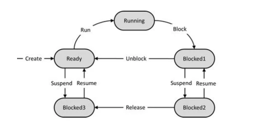

import { Aside } from '@astrojs/starlight/components';

## 問題 #12

以下の状態遷移図は、オペレーティングシステム（OS）の汎用スケジューラの振る舞いを記述したものです。

* **状態：** Ready, Running, Blocked1, Blocked2, Blocked3
* **遷移（イベント）：**
    * Ready &rarr; Run &rarr; Running
    * Running &rarr; Block &rarr; Blocked1
    * Blocked1 &rarr; Unblock &rarr; Ready
    * Blocked1 &rarr; Suspend &rarr; Blocked2
    * Blocked2 &rarr; Resume &rarr; Blocked1
    * Blocked2 &rarr; Release &rarr; Blocked3
    * Blocked3 &rarr; Resume &rarr; Ready
    * Ready &rarr; Suspend &rarr; Blocked3

テストは常に「Ready」状態で開始し、システムが「Ready」状態に戻ったときに終了すると想定します。つまり、テスト入力はシーケンス（"Ready", イベント, 次の状態, ..., イベント, "Ready"）で構成され、最初と最後の状態を除くすべての状態は "Ready" とは異なります。

**1スイッチカバレッジ（1-switch coverage）を達成するために必要な最小のテスト数はいくつか？**

* **a)** 2
* **b)** 3
* **c)** 4
* **d)** 5

---

## 正解

**c) 4**

---

## 解説

1スイッチカバレッジとは、連続する2つの遷移（遷移のペア）をすべて網羅する基準です。今回のモデルで網羅すべき「遷移のペア（1スイッチ）」は、以下の **9個** です。

1.  Ready &rarr; Running &rarr; Blocked1
2.  Running &rarr; Blocked1 &rarr; Ready
3.  Running &rarr; Blocked1 &rarr; Blocked2
4.  Blocked1 &rarr; Blocked2 &rarr; Blocked1
5.  Blocked1 &rarr; Blocked2 &rarr; Blocked3
6.  Blocked2 &rarr; Blocked1 &rarr; Ready
7.  Blocked2 &rarr; Blocked1 &rarr; Blocked2
8.  Blocked2 &rarr; Blocked3 &rarr; Ready
9.  Ready &rarr; Blocked3 &rarr; Ready

「Readyで始まり、Readyで終わる（途中はReadyを通らない）」という制約の下で、これらのペアを網羅する最小のテストパスを構成すると、以下の **4つ** になります。

* **テスト1:** Ready &rarr; Running &rarr; Blocked1 &rarr; Ready
    * 網羅：(1), (2)
* **テスト2:** Ready &rarr; Running &rarr; Blocked1 &rarr; Blocked2 &rarr; Blocked1 &rarr; Ready
    * 網羅：(1), (3), (4), (6)
* **テスト3:** Ready &rarr; Running &rarr; Blocked1 &rarr; Blocked2 &rarr; Blocked1 &rarr; Blocked2 &rarr; Blocked3 &rarr; Ready
    * 網羅：(1), (3), (4), (7), (5), (8)
* **テスト4:** Ready &rarr; Blocked3 &rarr; Ready
    * 網羅：(9)

これら4つのテストを実行することで、すべての1スイッチを網羅できます。

---

## ポイント

状態遷移テストにおけるカバレッジの考え方は、実務でも非常に重要です。

1.  **0スイッチカバレッジ:** すべての遷移（矢印）を少なくとも1回通る。
2.  **1スイッチカバレッジ:** すべての「遷移のペア（2連続の矢印）」を少なくとも1回通る。

1スイッチカバレッジを求められる場合、単純な遷移（0スイッチ）では見つからない「特定の状態を経由した後に発生する不具合」を検出できる可能性が高まります。試験では、今回のように「開始と終了の状態」に制約がある場合が多いため、図を描いてルートをパズルのように組み立てるのが定石です。
